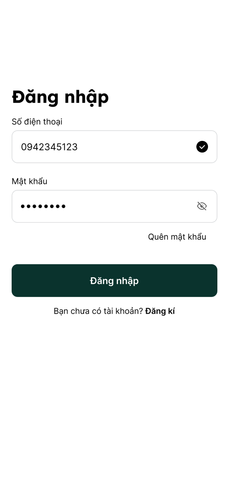
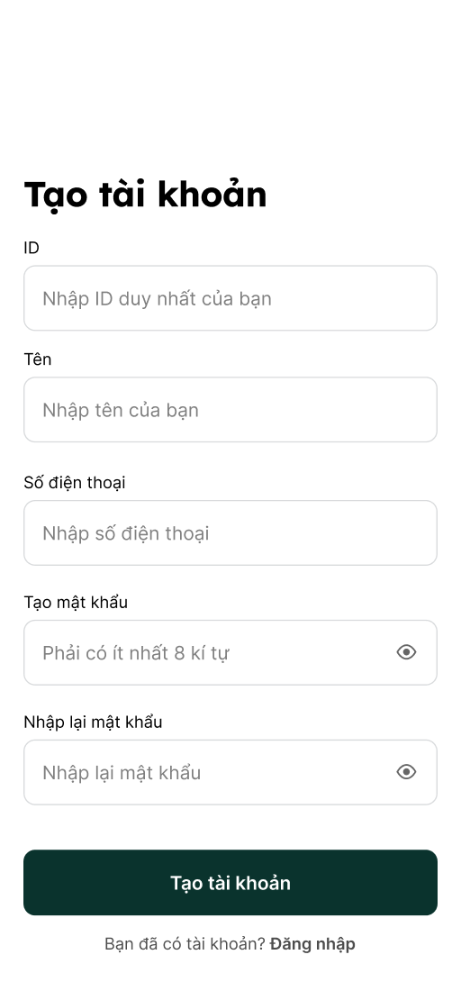
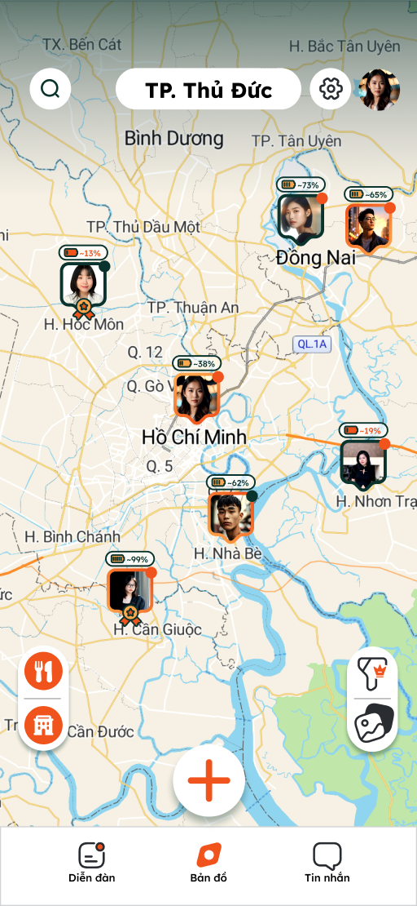
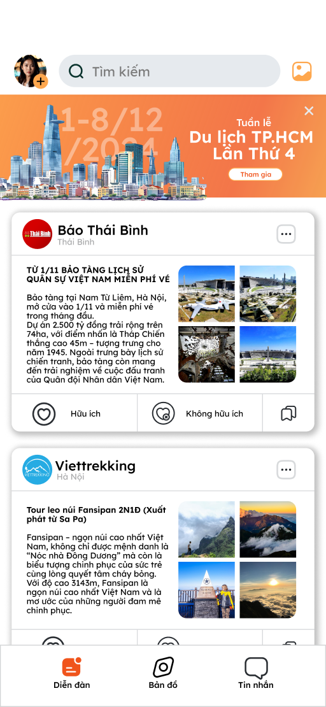
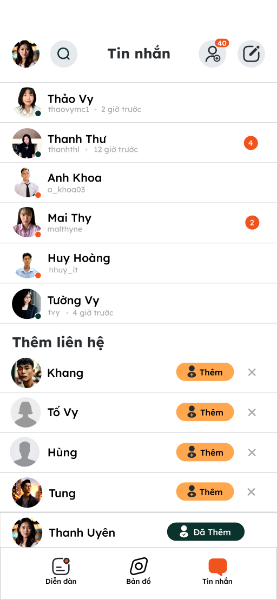
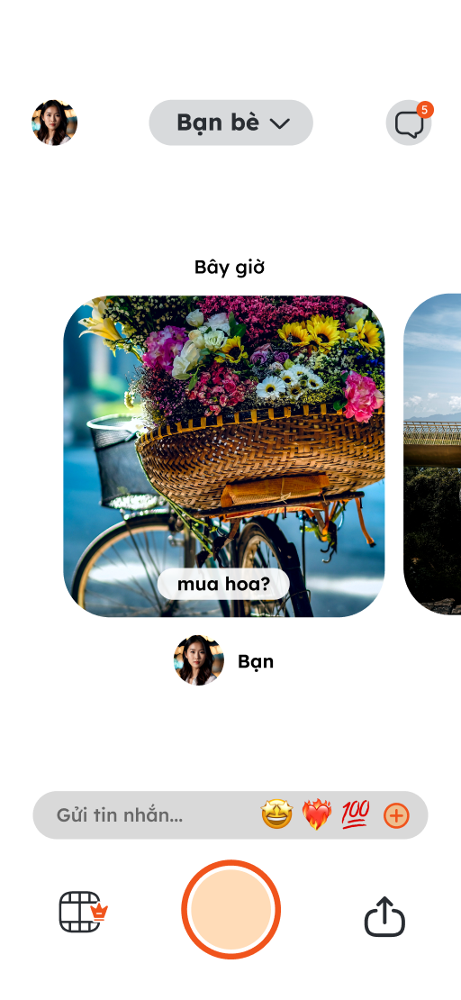
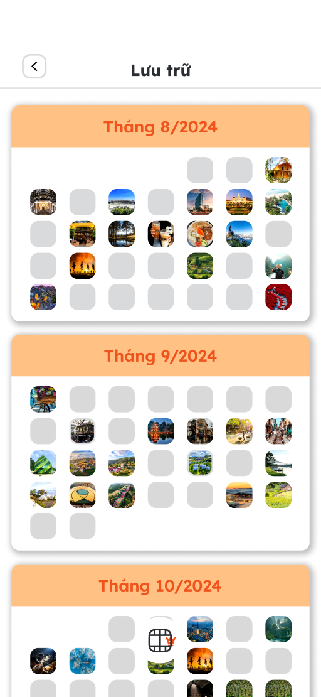

<h1 align="center">
	
</h1>

<h3 align="center">
  Orbit Map
</h3>

<p align="center">Future</p>

<p align="center">
  

  <a href="https://www.linkedin.com/in/eliasgcf/">
    
  </a>
  
  
  
  <a href="https://github.com/EliasGcf/readme-template/commits/master">
    
  </a>
  
  <a href="https://github.com/EliasGcf/readme-template/issues">
    
  </a>
  
  
</p>

<p align="center">
  <a href="#-about-the-project">About the project</a>&nbsp;&nbsp;&nbsp;|&nbsp;&nbsp;&nbsp;
  <a href="#-technologies">Technologies</a>&nbsp;&nbsp;&nbsp;|&nbsp;&nbsp;&nbsp;
  <a href="#-getting-started">Getting started</a>&nbsp;&nbsp;&nbsp;|&nbsp;&nbsp;&nbsp;
  <a href="#-how-to-contribute">How to contribute</a>&nbsp;&nbsp;&nbsp;|&nbsp;&nbsp;&nbsp;
  <a href="#-license">License</a>
</p>

## 😽 About the project

- <p style="color: red;">Brief explanation about the project</p>

Orbit Map Project is a mobile application that combines GPS-based location sharing with social networking features. The app displays a real-time interactive map, similar to traditional GPS apps, where users can see their friends’ locations along with their battery percentages. Orbit Map also integrates social features like instant messaging, similar to Messenger, and a photo-sharing experience inspired by Locket, allowing users to send live snapshots to their close contacts. With seamless connectivity, real-time updates, and a user-friendly interface, Orbit Map creates a dynamic way for friends to stay connected, share moments, and navigate the world together.

## 🖥 Technologies

Technologies that I used to develop this mobile client:

- [React Native Expo](https://expo.dev)
- [TypeScript](https://www.typescriptlang.org/)
- [Styled Components](https://styled-components.com/)
- [Eslint](https://eslint.org/)
- [Prettier](https://prettier.io/)
- [EditorConfig](https://editorconfig.org/)
- [React Native Maps](https://github.com/react-native-maps/react-native-maps)

## 👾 Getting started

### Requirements

**Clone the project and access the folder**

```bash
$ git clone https://github.com/supercoderl/OrbitMap.git && cd OrbitMap
```

**Follow the steps below**

```bash
# Install the dependencies
$ yarn install or npm install

# Be sure the file 'src/services/api.ts' have the IP to your API

# If you are going to use expo go, run this command
$ expo start
# Then use your device and scan the qr code

# If you are going to emulate with android, run this command
# Be sure to have the emulator open
$ expo start --android

# If you are going to emulate with ios, run this command
# Be sure to have the emulator open
$ expo start --ios
```

## 🤔 How to contribute

**Make a fork of this repository**

```bash
# Fork using GitHub official command line
# If you don't have the GitHub CLI, use the web site to do that.

$ gh repo fork https://github.com/supercoderl/OrbitMap.git
```

**Follow the steps below**

```bash
# Clone your fork
$ git clone https://github.com/supercoderl/OrbitMap.git && cd OrbitMap

# Create a branch with your feature
$ git checkout -b my-feature

# Make the commit with your changes
$ git commit -m 'feat: My new feature'

# Send the code to your remote branch
$ git push origin my-feature
```

After your pull request is merged, you can delete your branch

## Screenshots

<p>
<kbd></kbd>
<kbd></kbd>
<kbd></kbd>
	
<kbd></kbd>
<kbd></kbd>
<kbd></kbd>

<kbd></kbd>
<kbd></kbd>
</p>

## 📝 License

This project is licensed under the MIT License - see the [LICENSE](LICENSE) file for details.

---

Made with 💜 &nbsp;by Supercoderle 👋 &nbsp;[See my linkedin](https://www.linkedin.com/in/supercoderle)
